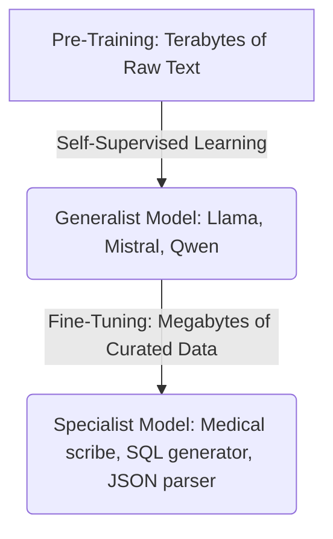

# Week 1 Day 1 — Why Fine-Tune?

## 🎯 Learning Objectives
* Define the differences between a generalist model (pre-trained) and a specialist model (fine-tuned).
* Evaluate business and technical scenarios to determine whether to use **Prompt Engineering**, **Retrieval-Augmented Generation (RAG)**, or **Fine-Tuning**.
* Understand the cost, latency, and performance trade-offs of using smaller fine-tuned open-weight models (e.g., 7B/8B parameters) versus large commercial closed APIs (e.g., GPT-4).

---

## 🧠 Core Concept: Generalists vs. Specialists

When a large language model is pre-trained (such as on terabytes of raw internet text), it becomes a **generalist**. It understands grammar, general facts, coding syntax, and common reasoning patterns. However, it is a jack-of-all-trades and master of none.

**Fine-tuning** is the process of taking this pre-trained model and training it further on a smaller, curated dataset representing a specific domain or task. This transforms the generalist into a **specialist**.



---

## 🏆 When Fine-Tuning Wins

Fine-tuning is highly effective in the following scenarios:

### 1. Consistent Formatting & Structure
* **The Problem:** Generalist models can hallucinate structural syntax (e.g., missing brackets in JSON, adding conversational filler like "Here is your JSON:").
* **The Fine-Tuning Solution:** By training on thousands of examples of raw input mapped to exact JSON schemas, medical reports, or legal clauses, the model learns the *structure* as a primary language rule. It outputs valid structured formats natively, without needing extensive system prompts or parser corrections.

### 2. Specialized Vocabulary & Domain Knowledge
* **The Problem:** Specific fields (medicine, law, corporate databases) use jargon, acronyms, or proprietary codes (like ICD-10 medical billing codes or internal API schema names) that do not appear frequently on the open web.
* **The Fine-Tuning Solution:** Fine-tuning exposes the model's weights to these specific vocabularies in context, adjusting its token probability distributions to understand and generate domain-specific terms accurately.

### 3. Strict Task-Specific Behavior
* **The Problem:** If you need a model to output *exactly* a single category score (e.g., `["HIGH", "MEDIUM", "LOW"]`) or act as a strict classification agent, general models will often write introductory or explanatory text despite negative constraints in the prompt.
* **The Fine-Tuning Solution:** You can train the model to map inputs directly to single-token outputs, eliminating conversational padding, reducing token consumption, and guaranteeing 100% compliance.

### 4. Economics & Latency (Inference Costs)
* **The Problem:** Using frontier models like GPT-4 or Claude 3.5 Sonnet is highly effective but expensive and introduces network latency.
* **The Fine-Tuning Solution:** A 7B or 8B model (like Llama-3-8B or Qwen-2.5-7B) fine-tuned on a narrow task can outperform GPT-4 on that task.
  * **Cost Comparison:** Running a local 8B model on a dedicated instance can be up to **90% cheaper** per million tokens at scale compared to closed commercial APIs.
  * **Latency:** Local inference reduces network overhead and enables techniques like speculative decoding, yielding much lower Time-To-First-Token (TTFT).

---

## ⚠️ When NOT to Fine-Tune

Fine-tuning is expensive in terms of time, compute, and data gathering. Avoid it if:

1. **Prompt Engineering Works:** If you can achieve 95%+ accuracy by writing a clean system prompt and providing 3–5 few-shot examples inside the context window (In-Context Learning), do not fine-tune.
2. **Small Datasets (< 500 examples):** Fine-tuning with too few examples causes the model to overfit (memorizing training inputs) or suffer from **style collapse/catastrophic forgetting** (losing its baseline reasoning capabilities).
3. **Dynamic/Real-Time Knowledge:** Fine-tuning is NOT a database. If your model needs to know "What is the stock price of Apple right now?" or "What is our company's current return policy?", fine-tuning is the wrong tool. Use **RAG** (Retrieval-Augmented Generation) to inject the facts at runtime.
4. **General Reasoning Capabilities:** If a model cannot solve a basic logical puzzle or write code during pre-training, fine-tuning it will not make it "smarter." Fine-tuning modifies style, format, and vocabulary alignment; it does not inject new generalized intelligence.

---

## 📊 Comparison Matrix

| Feature | Prompt Engineering | RAG (Retrieval-Augmented) | Fine-Tuning |
| :--- | :--- | :--- | :--- |
| **Setup Cost** | Negligible (Minutes) | Low to Medium (Days) | High (Weeks) |
| **Data Required** | None (Or few-shot examples) | Document corpus (PDFs/Webpages) | 500 – 10,000+ labeled samples |
| **Real-time Updates** | Instant (Update prompt) | Instant (Update database) | Slow (Requires retraining) |
| **Specialized Format** | Fair (Adherence can slip) | Fair (Depends on retrieved context) | Excellent (Natively trained) |
| **Token Cost** | High (Long context window) | High (Injects full documents) | Low (Short, concise prompts) |
| **Latency** | Medium-High (Longer prompts) | High (DB retrieval + long prompt) | Low (Shorter prompts & small model) |

---

## 📝 Hands-On Case Studies

Read the following scenarios and decide what approach (Prompting, RAG, or Fine-Tuning) fits best:

### Case Study A: The Clinical Dictation System
* **Goal:** A health-tech startup needs to take voice-to-text transcriptions of doctors talking to patients and format them into standard SOAP (Subjective, Objective, Assessment, Plan) medical charts.
* **Constraints:** Must use specialized medical vocabulary, guarantee strict structure, and handle highly sensitive HIPAA-compliant data locally (cannot send to OpenAI).
* **Recommendation:** **Fine-Tuning**. The need for strict formatting, specialized medical vocabulary, and local execution makes a fine-tuned 8B or 70B open-weight model hosted on private servers the ideal solution.

### Case Study B: The Company Policy Assistant
* **Goal:** An HR department wants a chatbot that answers employees' questions about the employee handbook, dental insurance coverage, and holiday schedules.
* **Constraints:** Handbooks and policy details change monthly.
* **Recommendation:** **RAG**. The information is dynamic and factual. Fine-tuning a model on the handbook would mean retraining it every time a policy changes. RAG allows you to simply update the vector database.

### Case Study C: Sentiment Analysis on Product Reviews
* **Goal:** A small e-commerce brand wants to label incoming customer reviews as `positive`, `neutral`, or `negative`.
* **Constraints:** Budget is extremely limited; they need to set this up in an afternoon.
* **Recommendation:** **Prompt Engineering**. Sentiment analysis is a general capability that all modern LLMs excel at out-of-the-box. A simple prompt with 3 few-shot examples will achieve near-perfect accuracy in minutes.

---

## 🛠️ Day 1 Practical Task

To solidify your understanding of these trade-offs, run the interactive **Fine-Tuning Decision Tool** in this directory:

```bash
python fine_tuning_decision_tool.py
```

Answer the questions about your project, and the tool will generate a professional assessment report recommending the optimal architecture.
