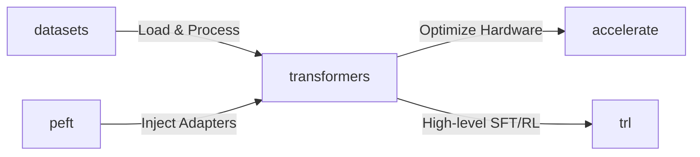

# Week 1 Day 2 — Hugging Face Ecosystem

## 🎯 Learning Objectives
* Understand the five core libraries of the Hugging Face ecosystem and their roles in the training pipeline.
* Explain the elements of a standard, high-quality **Model Card**.
* Create a Hugging Face account, generate a User Access Token, and clone or fork a dataset.
* Load a pre-trained model (`Qwen2.5`) locally and generate text responses.

---

## 🛠️ The 5 Pillars of the Hugging Face Ecosystem

Hugging Face (HF) provides a unified ecosystem that covers every stage of the machine learning lifecycle, from data curation to distributed training and parameter-efficient fine-tuning.



### 1. `transformers`
The backbone library for loading, tokenizing, and running inference on thousands of pre-trained models.
* **Key Components:**
  * `AutoTokenizer`: Automatically downloads and loads the correct vocabulary, byte-pair/wordpiece rules, and special tokens for a specific model ID.
  * `AutoModelForCausalLM` / `AutoModelForSequenceClassification`: Automatically instantiates the correct neural network architecture (e.g., Llama, Qwen, BERT) with the pre-trained weights.
  * `pipeline`: A high-level wrapper to run complex tasks (e.g., text generation, classification) in 3 lines of code.

### 2. `datasets`
A library designed for loading and processing massive text, audio, and image datasets using memory-mapped Apache Arrow tables under the hood (zero-copy reads, out-of-core memory management).
* **Why it matters:** It lets you manipulate datasets larger than your system RAM without crashing.
* **Key Commands:** `.map()` (parallel tokenization), `.filter()`, `.select()`, `.shuffle()`, `.train_test_split()`.

### 3. `peft` (Parameter-Efficient Fine-Tuning)
Instead of updating all 8 billion parameters (which requires massive VRAM for optimizer states), `peft` freezes the base model and injects tiny trainable adapter layers (like LoRA, Prefix Tuning, or P-Tuning).
* **Why it matters:** It reduces VRAM requirements by up to 70%, enabling fine-tuning on consumer-grade GPUs.

### 4. `trl` (Transformer Reinforcement Learning)
A high-level library built on top of `transformers` and `peft` designed specifically for training models using alignment methods:
* Supervised Fine-Tuning (`SFTTrainer`)
* Direct Preference Optimization (`DPOTrainer`)
* Group Relative Policy Optimization (`GRPOTrainer`)
* Reinforcement Learning from Human Feedback (PPO/RLHF)

### 5. `accelerate`
Abstracts away the boilerplate code needed to run PyTorch on different hardware platforms (single GPU, multi-GPU, TPUs, or mixed precision like FP16/BF16).
* **Why it matters:** You write standard code, and `accelerate` configures the device mapping and distributed training loops automatically via a simple CLI: `accelerate config`.

---

## 📄 Anatomy of a Good Model Card

A **Model Card** (the `README.md` file on a Hugging Face model page) is critical for reproducibility, transparency, and collaboration. A premium model card contains:

1. **Model Summary:** What is the model, its architecture size, and its release date (e.g., `Qwen2.5-7B-Instruct`).
2. **Intended Use Case:** Recommendations on when to use the model, and when NOT to use it.
3. **Training Details:** The dataset used, context length, learning rates, epochs, and hardware used for training.
4. **Evaluation Benchmarks:** Scores on standard datasets (e.g., MMLU, GSM8K, HumanEval) compared to base models or competitors.
5. **Prompt Template / Format:** The exact format the model expects to follow instructions (e.g., ChatML format `<|im_start|>system...`).
6. **Limitations & Biases:** Warnings about known hallucinations, language coverage limits, or toxic outputs.

---

## 🌐 Hands-On: Setting Up Your Hugging Face Hub

### Step 1: Create an Account
1. Go to [Hugging Face](https://huggingface.co/) and click **Sign Up**.
2. Follow the verification steps.

### Step 2: Create a User Access Token
To download gated models (like Llama 3) or push your own models/datasets, you need an access token:
1. Go to your **Profile Settings** -> **Access Tokens**.
2. Click **New token**.
3. Name it (e.g., `deepseed-training`) and set the type to **Write**.
4. Copy the token. Keep it secure!

### Step 3: Log In via CLI
Open your terminal inside your virtual environment and login:
```bash
pip install huggingface_hub
huggingface-cli login
```
Paste your write token when prompted.

### Step 4: Fork a Dataset (Exercise)
To practice working with datasets:
1. Browse to a dataset, for example: [tatsu-lab/alpaca](https://huggingface.co/datasets/tatsu-lab/alpaca) (a popular instruction-tuning dataset).
2. Click the **three dots** in the top right corner and click **Fork dataset**.
3. Choose your username as the target. You now have a copy of the dataset under your own namespace (e.g., `yourusername/alpaca`) which you can modify and update!

---

## 🚀 Running Your First Qwen2.5 Inference

Today's practical task is to run local inference on a Qwen2.5 instruction model. We will use `Qwen/Qwen2.5-1.5B-Instruct` because it is lightweight, downloads fast, and runs comfortably on consumer CPUs and GPUs.

### How to Run:
1. Ensure your environment has the required libraries:
   ```bash
   pip install torch transformers accelerate
   ```
2. Execute the script:
   ```bash
   python hf_inference_demo.py
   ```
3. Observe how the tokenizer structures the dialogue using the chat template, and watch the model stream its response!
