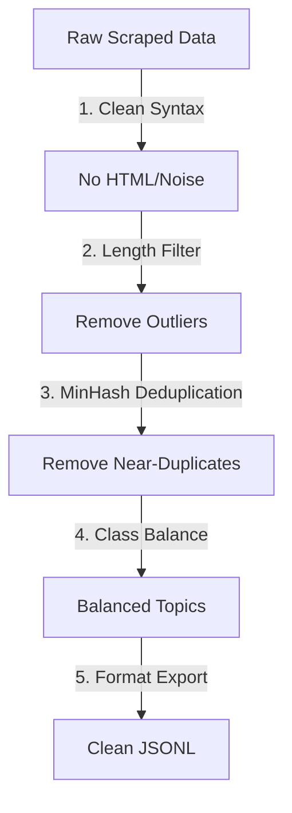

# Week 1 Day 3 — Dataset Curation & Formatting

## 🎯 Learning Objectives
* Understand standard dataset formats for instruction tuning (Alpaca vs. ShareGPT).
* Explain why near-duplicates degrade model quality and how to identify them using **MinHash** and **Jaccard Similarity**.
* Understand quality-filtering techniques like length-filtering and perplexity-filtering.
* Apply class and topic balancing to ensure representative training datasets.

---

## 🗑️ The Gold Standard: Quality > Quantity
In LLM fine-tuning, **"Garbage In, Garbage Out"** is an absolute law. Pre-training models are resilient to web noise due to the massive volume of data, but fine-tuning modifies a model's instruction-following style and behavior quickly. 

* **The Reality:** A dataset of 2,000 highly curated, verified, and deduplicated examples will consistently outperform a noisy, auto-generated dataset of 50,000 samples. 

---

## 📁 Instruction Dataset Schemas

There are two primary industry-standard formats for formatting instruction-tuning datasets.

### 1. The Alpaca Schema (Single-Turn)
Developed by Stanford, this format divides each example into an instruction, an optional context input, and the desired response output.

```json
{
  "instruction": "Convert the following temperature from Celsius to Fahrenheit.",
  "input": "37",
  "output": "98.6"
}
```
* **Use Case:** Best for single-turn tasks like data extraction, text classification, and single-question Q&A.

### 2. The ShareGPT Schema (Multi-Turn Conversational)
Used by Llama-Factory, FastChat, and Axolotl, this format represents a list of dialogue turns between a user (`human`/`user`) and the model (`gpt`/`assistant`).

```json
{
  "conversations": [
    {"from": "human", "value": "Hello, who are you?"},
    {"from": "gpt", "value": "I am an AI assistant trained to help you."},
    {"from": "human", "value": "What is the capital of France?"},
    {"from": "gpt", "value": "The capital of France is Paris."}
  ]
}
```
* **Use Case:** Best for training conversational agents, multi-step reasoning assistants, or chatbots that remember history.

---

## 🧼 Step-by-Step Curation Pipeline

To build a premium fine-tuning dataset, raw data must pass through several stages of engineering:



### 1. Syntax & Text Cleaning
Remove HTML/XML tags, fix double-spacing, strip system artifacts (e.g., logging lines, debug text), and clean up formatting artifacts.

### 2. Length Filtering
* **Under-length filters:** Remove examples where the response is extremely short (e.g., "OK", "Yes", "Error") unless it is a specific classification task. These do not teach the model reasoning.
* **Over-length filters:** Remove examples that exceed your context window limit (e.g., 2048 or 4096 tokens). Extremely long context examples slow down training, increase VRAM usage exponentially, and can lead to truncation errors.

### 3. Near-Duplicate Deduplication (MinHash)
Having identical or near-identical examples in your training dataset is dangerous:
1. **Overfitting:** The model memorizes the specific answer phrasing rather than learning the general skill.
2. **Weight Distortion:** The model's loss landscape becomes skewed towards the duplicate prompts, causing it to generate highly repetitive outputs.

#### The Mathematics:
* **$k$-Shingles:** Break a text string into overlapping substrings of length $k$ (e.g., words or characters).
  * Example text: *"Fine-tuning is great"* 
  * 2-word shingles: `{"Fine-tuning is", "is great"}`
* **Jaccard Similarity:** Compares the overlap of shingles between Document $A$ and Document $B$:
  $$J(A, B) = \frac{|A \cap B|}{|A \cup B|}$$
  * A Jaccard similarity of $\ge 0.8$ usually indicates that two documents are near-duplicates (e.g. same text with minor spelling changes or spacing).
* **MinHash:** Comparing all document shingles pairwise in a huge dataset is computationally expensive ($O(N^2)$). MinHash solves this by hashing shingles and storing only a small "signature vector" of minimum hash values, reducing comparison times to $O(N)$.

### 4. Perplexity Quality Filtering
Perplexity measures how "surprised" a language model is by a sequence of words.
* Run your dataset through a small, fast pre-trained model (like GPT-2 or Llama-3-8B in evaluation mode) and calculate the perplexity of each training sample.
* **High perplexity** indicates text that is unstructured, corrupt (OCR gibberish), or has poor grammar. These samples are filtered out to prevent the model from learning bad habits.

### 5. Class & Topic Balancing
If your training set has 9,000 examples of Python code generation and only 100 examples of SQL, the model will struggle with SQL queries or try to answer SQL queries with Python.
* Classify data into topic buckets.
* Downsample dominant classes or synthesize additional data for minority classes to ensure an even distribution.

---

## 🛠️ Day 3 Practical Task

Run the dataset curation script in this directory:

```bash
python curate_dataset.py
```

This script generates a raw, dirty mock dataset containing HTML tags, near-duplicate entries, length outliers, and unbalanced classes. It then runs a full cleaning pipeline—including a **MinHash deduplicator** built from scratch—and exports a clean instruction dataset.
